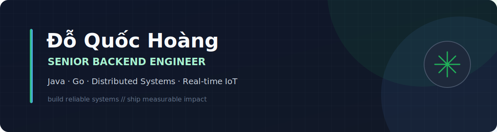

  

## Impact snapshot

<table>
<tr>
<td align="center" width="33%"><strong>5+ years</strong> backend engineering</td>
<td align="center" width="33%"><strong>1.6M+ customers</strong> utility billing network</td>
<td align="center" width="33%"><strong>50 vehicles</strong> IoT pilot deployment</td>
</tr>
</table>

> I build scalable, data-intensive systems from architecture to production. My focus is reliable backend engineering where performance, security, and product delivery meet.

## What I build

<table>
<tr>
<td width="50%" valign="top">

### 01 · Distributed systems

Event-driven services, multi-tenant platforms, asynchronous processing, and database optimization for high-volume workloads.

`Java` `Go` `Kafka` `Redis` `Elasticsearch`

</td>
<td width="50%" valign="top">

### 02 · Real-time products

Connected fleet operations with WebSockets, MQTT device management, telemetry, alerts, and remote commands.

`Gin` `PostgreSQL` `MQTT` `EMQX` `WebSockets`

</td>
</tr>
<tr>
<td width="50%" valign="top">

### 03 · Secure integrations

Fintech gateways and production APIs with VietQR, JWE/JWS, JWT, RBAC, and distributed caching.

`Spring Boot` `JWE/JWS` `OAuth2` `JWT` `RBAC`

</td>
<td width="50%" valign="top">

### 04 · Full-stack delivery

From backend architecture to web dashboards, mobile apps, containerized deployments, and CI/CD.

`React` `Vue` `Flutter` `Docker` `GitHub Actions`

</td>
</tr>
</table>

## Selected systems

### EV-Rental CRM & IoT Fleet Platform

Building a Go platform for renter onboarding, contracts, finance, fleet operations, and connected in-vehicle devices. The current rollout targets a **50-vehicle pilot**.

### Multi-Tenant Water Utility Platform

Built billing and operational systems for multiple SAWACO subsidiary utilities, supporting a network of **1.6M+ metered customers** with tenant-specific rules and workflows.

### Real-Time & Fintech Modernization

Introduced Kafka pipelines, Elasticsearch search, Redis distributed caching, real-time notifications, and secure VietQR banking integration.

## Tech stack

`Java` · `Go` · `Spring Boot` · `Grails` · `Gin` · `Fiber` · `PostgreSQL` · `SQL Server` · `MySQL` · `MongoDB` · `Redis` · `Elasticsearch` · `Kafka` · `MQTT/EMQX` · `Docker` · `GitHub Actions` · `Prometheus` · `Grafana`

## Open-source

### [jcode-agentpet-bridge](https://github.com/hoangdq08/jcode-agentpet-bridge)

A Go bridge that exposes Jcode TUI state to the AgentPet macOS menu-bar companion through debug-socket polling.

## Background

- **Freelance Backend Engineer**, Self-employed · Apr 2026 – Present
- **Senior Backend Engineer**, TriAnh Solutions · Feb 2021 – Mar 2026
- **B.Eng. Artificial Intelligence**, University of Information Technology, VNU-HCM · Expected 2026

**Open to backend engineering conversations and interesting systems problems.**

[LinkedIn](https://www.linkedin.com/in/ho%C3%A0ng-%C4%91%E1%BB%97-408567389/) · [Email](mailto:hoangdo.dev08@gmail.com)

