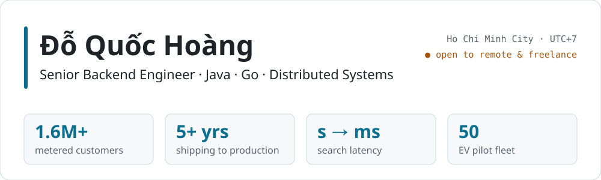
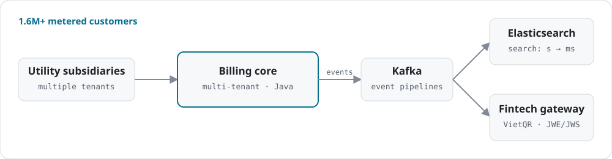
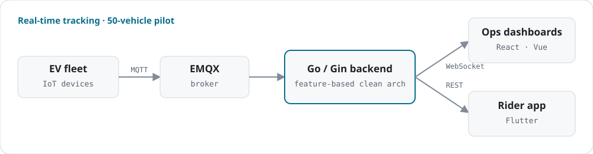

<picture>
  <source media="(max-width: 600px) and (prefers-color-scheme: dark)" srcset="assets/banner-mobile-dark.svg">
  <source media="(max-width: 600px)" srcset="assets/banner-mobile-light.svg">
  <source media="(prefers-color-scheme: dark)" srcset="assets/banner-dark.svg">
  
</picture>

I build **backend systems that handle real money and real load**: multi-tenant billing, event-driven pipelines on **Kafka**, fintech gateways, and real-time **IoT fleet platforms**. 5+ years from architecture to production, mostly **Java (Spring, Grails)** and **Go (Gin)**, with full-stack delivery when a product needs it.

[LinkedIn](https://www.linkedin.com/in/hoangdq08/) · [Email](mailto:hoangdo.dev08@gmail.com) · **Open to remote and freelance backend roles.**

## Selected work

### Multi-tenant water-utility billing core
**TriAnh Solutions** · Backend → Senior Backend Engineer · *Feb 2021 – Mar 2026*

<picture>
  <source media="(max-width: 600px) and (prefers-color-scheme: dark)" srcset="assets/billing-mobile-dark.svg">
  <source media="(max-width: 600px)" srcset="assets/billing-mobile-light.svg">
  <source media="(prefers-color-scheme: dark)" srcset="assets/billing-dark.svg">
  
</picture>

- Billing core shared by multiple SAWACO subsidiaries, serving **1.6M+ metered customers**
- Kafka event-driven pipelines plus an Elasticsearch search layer: search latency from **seconds to milliseconds**
- Secure fintech gateway (VietQR, JWE/JWS). Mentored 2 junior engineers

### EV-rental CRM & IoT fleet platform
**Freelance** · Backend Engineer · *Apr 2026 – Present*

<picture>
  <source media="(max-width: 600px) and (prefers-color-scheme: dark)" srcset="assets/fleet-mobile-dark.svg">
  <source media="(max-width: 600px)" srcset="assets/fleet-mobile-light.svg">
  <source media="(prefers-color-scheme: dark)" srcset="assets/fleet-dark.svg">
  
</picture>

- Go/Gin backend with feature-based clean architecture, for a paying client
- Live vehicle tracking over **WebSockets**, device management via **MQTT/EMQX**
- Rolling out to a **50-vehicle pilot**, with full-stack ownership (Go, React/Vue, Flutter, Docker)

Both systems are private client work. Open-source projects are pinned below.

## Stack

Also: Gin, Grails, MQTT/EMQX, WebSocket, MongoDB, React, Vue, Flutter, FastAPI, GitHub Actions, Grafana.

---

🎓 B.Eng. in Artificial Intelligence, University of Information Technology (VNU-HCM), expected Jun 2027. Repos named `uit-*` are team course projects.
