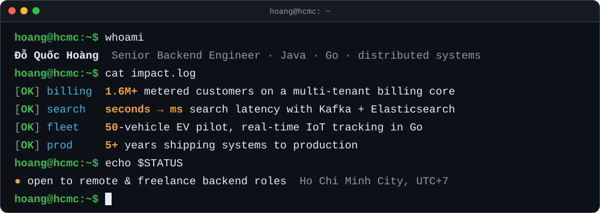

<picture>
  <source media="(max-width: 600px)" srcset="assets/terminal-mobile.svg">
  
</picture>

I build **backend systems that handle real money and real load**: a multi-tenant billing core with Kafka, Elasticsearch and a VietQR gateway at TriAnh Solutions, and now a Go + MQTT fleet platform for an EV-rental client. Both are private, so the pinned repos are open-source and course work.

**[LinkedIn](https://www.linkedin.com/in/hoangdq08/)** · **[Email](mailto:hoangdo.dev08@gmail.com)**

🎓 B.Eng. in AI, University of Information Technology (VNU-HCM), expected Jun 2027. `uit-*` repos are team course projects.
